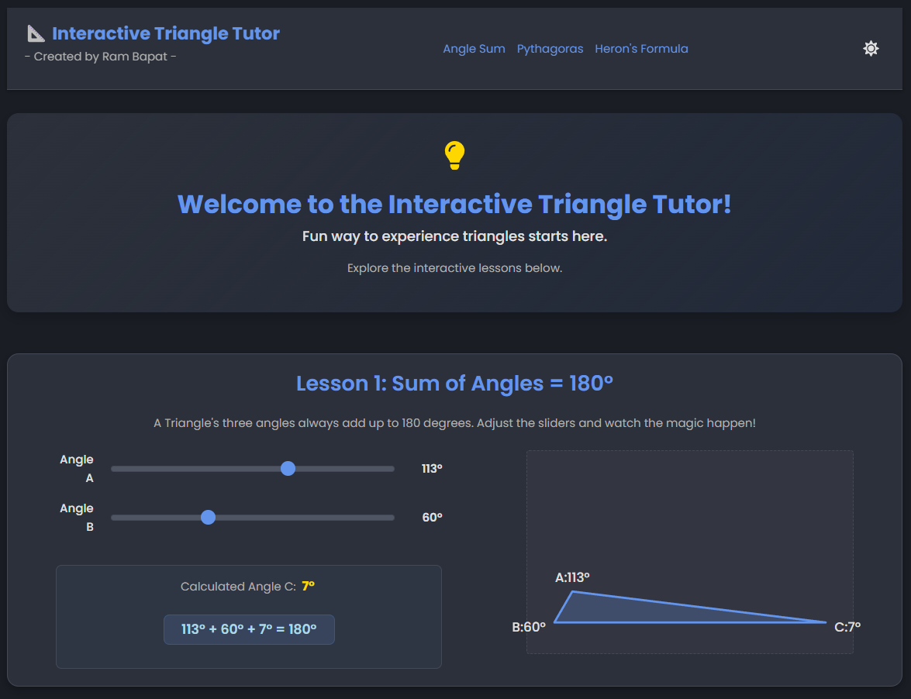
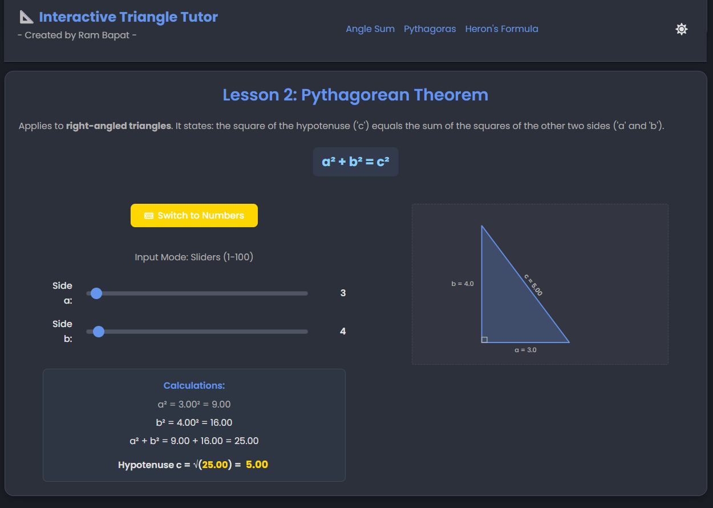
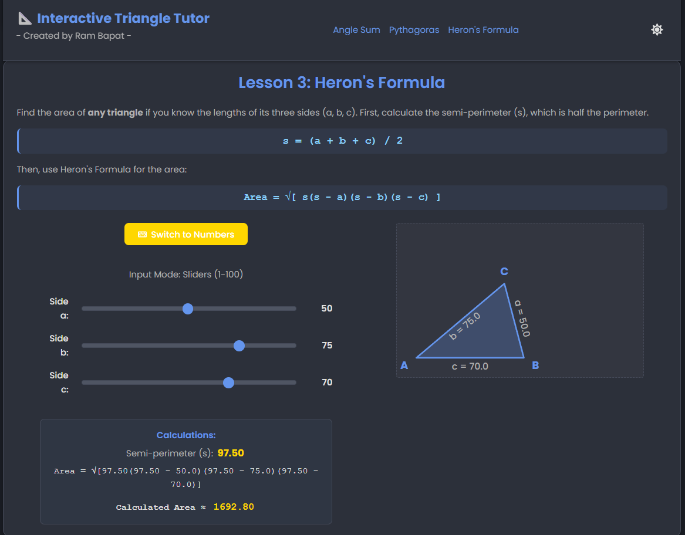

# Interactive Triangle Learning - By Ram Bapat 📐✨

## Try live demo - (Demo)[https://interactive-triangle-learning.vercel.app/]

An interactive and visually engaging web application built with React and Vite to teach fundamental triangle concepts, developed as part of the "30 Days of Vibe Coding" challenge.

<!-- ================================================== -->






<!-- ================================================== -->

## Overview

This project provides a modern, interactive platform for learning three key triangle properties:

1.  **Sum of Angles:** Demonstrates interactively that the sum of angles in any triangle is always 180°. Users can adjust two angles using sliders and see the third angle and the triangle's shape update in real-time via an SVG visualization.
2.  **Pythagorean Theorem:** Teaches the relationship `a² + b² = c²` in right-angled triangles. Users can input lengths for sides 'a' and 'b' (using sliders or number inputs) and see the calculated hypotenuse 'c' along with a dynamic SVG representation.
3.  **Heron's Formula:** Allows users to calculate the area of any triangle given its three side lengths (a, b, c), again using sliders or number inputs. It includes validation (Triangle Inequality) and an SVG visualization that adapts to the input side lengths.

The application features a clean, responsive design with a light/dark theme toggle, all presented on a single page with smooth scrolling navigation.

## Vibe Coding & AI Collaboration 🤖✨

This project is **Day 5** (April 5th, 2025) of my **#30DaysOfVibeCoding** challenge. The development heavily utilized AI assistance in a "Vibe Coding" approach:

*   **Initial Scaffolding:** AI helped set up the initial React + Vite project structure.
*   **Component Generation:** Provided starting points and boilerplate code for React components and CSS modules.
*   **Interactive Logic:** Assisted in developing the state management (`useState`, `useMemo`, `useCallback`) and mathematical calculations for each lesson's interactivity (angle adjustments, Pythagoras calculation, Heron's formula, Triangle Inequality).
*   **SVG Visualization:** Generated and refined the SVG rendering logic, including coordinate calculations (Law of Sines/Cosines based approaches) and dynamic updates based on state changes. Helped debug positioning and rotation issues for labels.
*   **Styling & Theming:** Suggested CSS styles, layout techniques (Flexbox, Grid), color palettes, and implemented the light/dark theme toggle mechanism.
*   **Refactoring:** Guided major refactoring steps, such as consolidating lessons onto a single page and implementing the shared `Layout` component.
*   **Debugging:** Helped identify and fix errors, including console errors related to conditional rendering and visual glitches like label positioning.

The process involved iterative refinement – generating code/ideas with the AI, testing, providing feedback, and requesting modifications, embodying the "vibe" of exploring possibilities with an AI partner.

## Features

*   **Three Interactive Lessons:** Angle Sum, Pythagorean Theorem, and Heron's Formula.
*   **Dynamic SVG Visualizations:** Triangle shapes and labels update in real-time based on user input.
*   **Dual Input Modes:** Toggle between sliders (1-100 range) and direct number input for Pythagoras and Heron's lessons.
*   **Real-time Calculations:** Formulas are calculated and displayed instantly.
*   **Input Validation:** Includes checks for positive numbers and the Triangle Inequality theorem for Heron's Formula.
*   **Light/Dark Theme Toggle:** User preference is saved in localStorage.
*   **Single Page Application:** Smooth scrolling navigation between lessons using `react-router-hash-link`.
*   **Responsive Design:** Adapts to various screen sizes (desktop, tablet, mobile).
*   **Modern UI:** Clean layout using CSS Variables, Flexbox, and Grid.
*   **Component-Based:** Built with reusable React components.

## Tech Stack

*   **Frontend:** React 18+
*   **Build Tool:** Vite
*   **Styling:** CSS3 (Custom Properties, Flexbox, Grid, Transitions)
*   **Language:** JavaScript (ES6+)
*   **Routing:** `react-router-dom`, `react-router-hash-link`
*   **Icons:** `react-icons`
*   **Package Manager:** npm

## Getting Started

To get a local copy up and running, follow these simple steps.

### Prerequisites

*   Node.js (v18+ recommended, includes npm) installed on your system. Download from [nodejs.org](https://nodejs.org/).
*   Git (for cloning the repository).

### Installation & Setup

1.  **Clone the repository:**
    ```bash
    git clone https://github.com/Barrsum/Interactive-Triangle-Learning.git
    ```

2.  **Navigate to the project directory:**
    ```bash
    cd Interactive-Triangle-Learning
    ```

3.  **Install NPM packages:**
    ```bash
    npm install
    ```
    *(This installs React, Vite, and other base dependencies listed in `package.json`)*

4.  **Install specific libraries used:**
    ```bash
    npm install react-router-dom react-router-hash-link react-icons
    ```

### Running the Project

1.  **Start the development server:**
    ```bash
    npm run dev
    ```

2.  **Open the application:**
    Open your web browser and navigate to the local URL provided by Vite (usually `http://localhost:5173/`).

## Contributing

Contributions, issues, and feature requests are welcome! Feel free to check the [issues page](https://github.com/Barrsum/Interactive-Triangle-Learning/issues).

1.  Fork the Project
2.  Create your Feature Branch (`git checkout -b feature/NewTriangleConcept`)
3.  Commit your Changes (`git commit -m 'Add interactive lesson for Sine Rule'`)
4.  Push to the Branch (`git push origin feature/NewTriangleConcept`)
5.  Open a Pull Request

## License

Distributed under the MIT License. See `LICENSE.md` for more information.

## Acknowledgements

*   **React:** [react.dev](https://react.dev/)
*   **Vite:** [vitejs.dev](https://vitejs.dev/)
*   **React Router:** [reactrouter.com](https://reactrouter.com/)
*   **React Icons:** [react-icons.github.io/react-icons/](https://react-icons.github.io/react-icons/)

---

Built by Ram Bapat - Challenge [\#30DaysOfVibeCoding](https://www.linkedin.com/posts/ram-bapat-barrsum-diamos_vibecoding-ai-machinelearning-activity-7312839191153860608-wQ8y?utm_source=share&utm_medium=member_desktop&rcm=ACoAAEokGUcBG1WEFP4A_IMlyO4LNl-eu2MD52w) - [LinkedIn Profile](https://www.linkedin.com/in/ram-bapat-barrsum-diamos)
